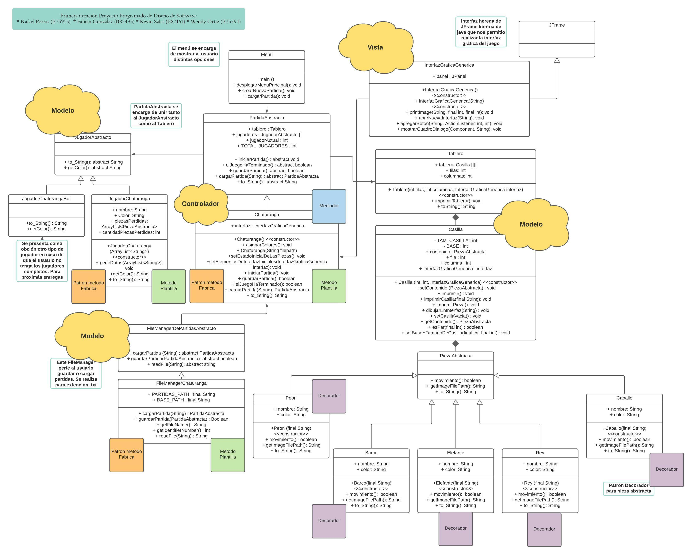

***Primera Iteración del Proyecto Programado de Diseño de Software:***

Implementación de un Chaturanga con los patrones vistos en clase

Integrantes:  

              ** Rafael Porras (B75915) 
              ** Fabian Gonzalez (B83493) 
              ** Kevin Salas (B87161)
              ** Wendy Ortiz (B75594)
              
MANUAL DE USO

1. Luego de ubicarse en el path correspondiente al proyecto, se debe ingresar a la carpeta src, compilar con "javac Menu.java" y correrlo con "java Menu".
2. Seguido de eso se mostrara una interfaz gráfica donde se solicitará los nombres y el respectivo color de cada uno de los 4 jugadores.
3. Por ultimo se mostrará el tablero de juegos.

Modelo de clases:

Link : [Acceso al modelo actualizado](https://lucid.app/lucidchart/5ab7cf6b-e7b0-41e3-a822-30268901e57f/edit?invitationId=inv_cba40b48-ef38-4f71-a1f6-81cd0827e5ec&page=2GWogsdkf0.o#)